# 2025年排名前20的美妆代发平台汇总(最新整理)

想做美妆生意但担心库存积压?想创建自己的化妆品品牌却被高昂的启动成本吓退?美妆代发模式正在改变这个行业的游戏规则。从护肤品到彩妆,从私标定制到一件代发,这些平台让你零库存风险就能启动美妆事业。本文精选20家经过市场验证的美妆代发供应商,覆盖从入门级到专业级的各类需求,帮你快速找到最适合自己业务模式的解决方案。

---

## **[Jubilee](https://www.jubilee.beauty)**

零门槛打造美国品质的私标美妆品牌,适合想快速测试市场的新手卖家。

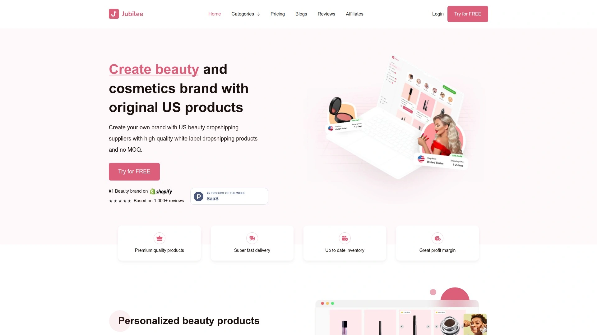

Jubilee是一个专注于美妆和护肤品代发的平台,让创业者无需最低订购量(MOQ)就能创建自己的美妆品牌。平台80%的供应商位于美国或欧洲,确保物流速度和产品可靠性。

**核心功能特点:**
- 支持logo定制、品牌发票等私标服务,产品直接以你的品牌名义发货
- 从仪表盘直接下单样品,几次点击就能测试产品和供应商质量
- 涵盖化妆品、香水、护肤品、身体护理等全品类美妆产品
- 美国本土发货通常5-14天送达,国际订单时效也相对可控

**适用场景:** 特别适合Shopify店主和想要快速启动美妆品牌的电商新手,免费计划让你可以先探索产品目录再决定升级。对于追求"美国制造"标签和快速交付的卖家来说,Jubilee提供了理想的平衡点。

**定价考量:** 平台提供免费入门方案,产品单价从6美元起(如口红),粉底和高光类产品约10-15美元。批量订购时享有阶梯定价优惠,让业务扩展更经济。

---

## **[Blanka](https://blankabrand.com)**

北美顶级私标化妆品平台,10件起订即可定制品牌。

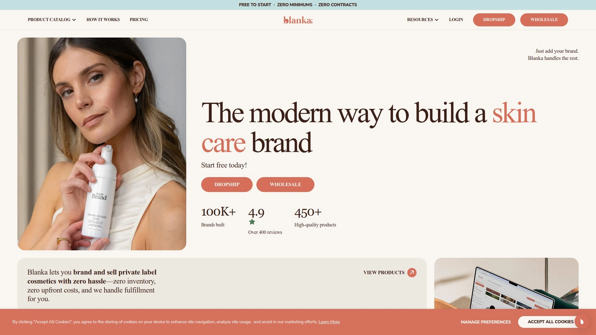

Blanka专注于为代发卖家提供私标化妆品和护肤品,以现成配方快速打上你的品牌logo。平台强调"零最低量、零合同"的灵活模式,降低创业门槛。

**产品线深度:** 提供粉底(从浅色到深色调多种色号)、口红(哑光和光泽质地)、睫毛膏、眼影、高光以及化妆工具如刷具和海绵。所有产品在北美生产,采用无残忍测试和清洁成分。

**品牌定制优势:** 最低10件起订即可实现品牌定制包装,让小规模测试成为可能。与Shopify无缝集成,后台操作流畅高效。

**用户体验:** 客户支持响应迅速,帮助解决从产品选择到物流追踪的各类问题。美国订单通常5-10天送达,全球发货7-21天。

需要注意的是,部分产品定价略高于市场平均水平,国际运费和时效也可能增加成本。但对于瞄准高端美妆市场、需要快速白标方案的创业者来说,Blanka的高品质配方和快速定制能力值得这个溢价。

***

## **[Selfnamed](https://www.selfnamed.com/en)**

19年欧洲美妆制造经验,150+款高端护肤品零起订。

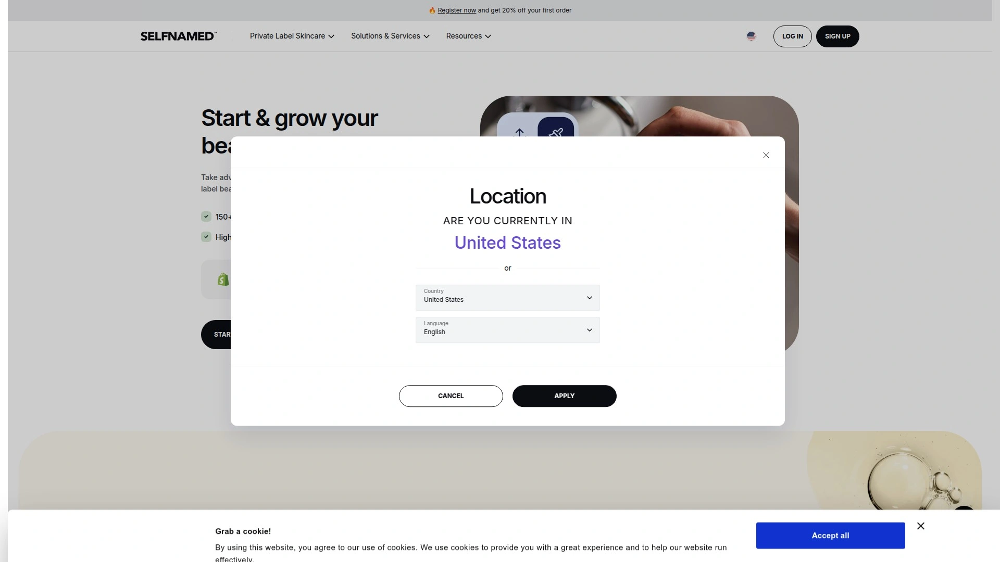

Selfnamed将19年的化妆品行业专业知识转化为零门槛的品牌加速服务。平台最大特色是完全没有最低订购量——你可以只订1件产品,也可以订购数千件。

**全方位定制能力:**
从150多款清洁美妆产品中选择,每款产品都可以完全定制以匹配你的品牌视觉。无论是初创品牌还是扩展现有产品线,Selfnamed都能提供灵活支持。

**物流与合规优势:**
- 从美国和欧洲仓库发货,最快3天送达30多个国家
- 所有产品经过认证,符合欧盟、英国、美国的当地法规
- 可选代发模式或批量订购,完全按你的节奏经营

**盈利能力分析:** 以其明星产品为例,批量采购价约£10,建议零售价£19.14,毛利率可达131.58%。对于准备规模化的企业,Selfnamed年产能高达500万件,提供定制化扩展方案。

用户反馈普遍称赞产品质量、设计平台的易用性以及客户支持的专业响应。如果你追求欧洲品质标准和灵活的订购政策,Selfnamed是理想选择。

***

## **[DR.HC Cosmetics](https://drhc-cosmetics.com)**

美国制造的有机纯素化妆品,每瓶都打上你的品牌标识。

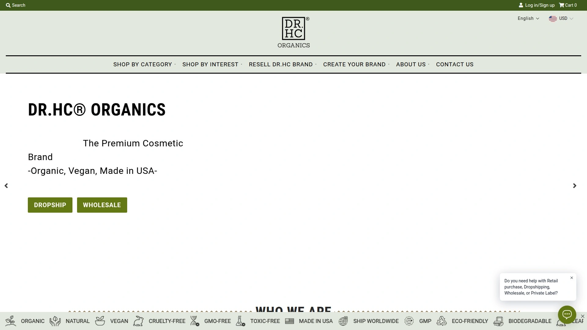

DR.HC Cosmetics提供独特的"YOURS私标代发项目",让创业者以零库存方式推出自己的化妆品品牌。该平台是美国本土的私标/白标制造商,面向全球零售商提供快速发货代发服务。

**核心差异化价值:** 与其他只在包装盒上印logo的服务不同,DR.HC将你的品牌直接印在每个化妆品瓶身上,让产品真正以你的品牌身份销售。当客户下单时,你只需从平台订购(支持自动或手动下单),DR.HC会制造并直接发货给你的客户,整个过程不显示DR.HC的名称。

**产品哲学:** 主打天然/有机、纯素、无残忍的护肤品和化妆品配方。所有产品美国制造,符合行业最高标准。

**启动成本优势:** 传统上创建化妆品品牌仅一条产品线就需要数千美元的研发和前期成本,而DR.HC的模式大幅降低投资门槛,同时带来更多长期收益。

发货时效为5-21天,根据目的地不同有所差异。对于想要打造真正自主品牌、而非简单转售他人产品的创业者,这个平台提供了罕见的真实品牌所有权体验。

***

## **[Supliful](https://supliful.com)**

健康美容双栖平台,护肤品重复购买率高达60天一次。

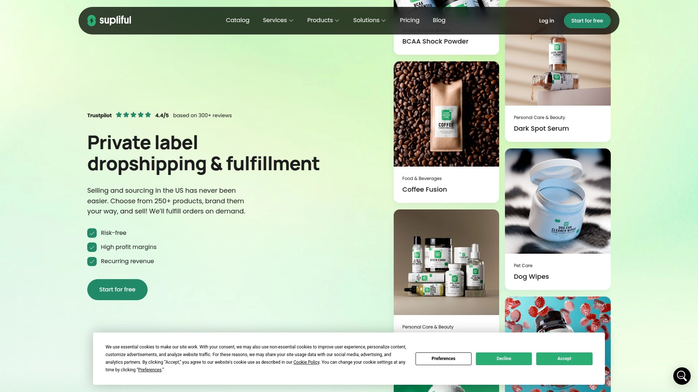

Supliful最初以补充剂闻名,后扩展至自护和美容产品的白标代发服务。平台强调"无前期费用、无库存管理、灵活的批量定价"。

**商业模式优势:**
护肤品是高重购率品类,大多数客户每30-60天复购一次,为长期增长奠定基础。这使其完成适合订阅盒模式或作为高毛利升级产品。

**多渠道适配性:**
- 从Shopify店铺到TikTok和Instagram,护肤品牌在社交电商平台表现出色
- 提供实验室测试配方、全程履约和持续支持,零库存风险
- 适合美容工具公司、护肤市场专业人士和美妆博主等多种业务类型

**细分场景应用:**
对于销售微电流设备或LED面罩的商家,Supliful的私标护肤品是完美附加产品。对于想要在扩大生产前测试新品的护肤专业人士,平台提供无承诺的实验空间。

从美国仓库发货,时效快捷,专注于市场就绪的包装和产品美学。如果你的目标是构建基于订阅或社交媒体驱动的护肤品牌,Supliful的重购友好特性和全渠道支持值得深入了解。

***

## **[Beauty Joint](https://beautyjoint.com)**

美国品牌化妆品批发商,全球代发无需预存库存。

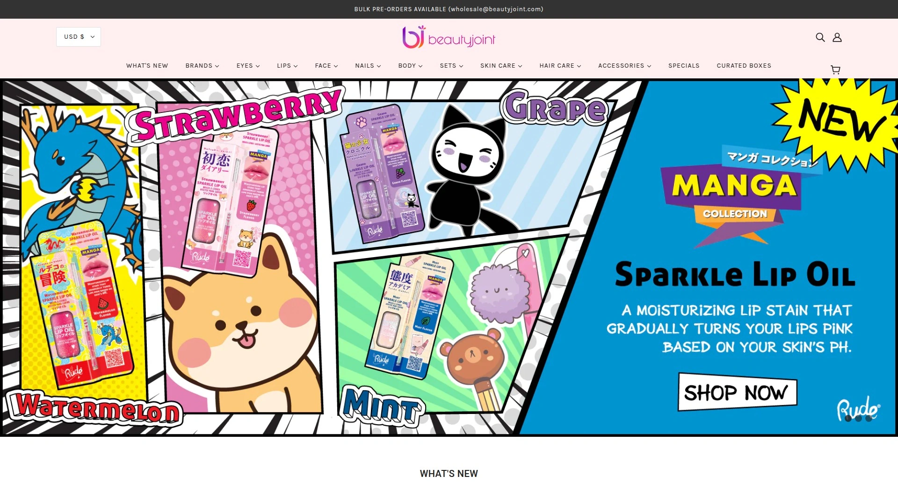

Beauty Joint是专注于品牌化妆品、护肤品和美甲产品的代发供应商。平台将产品直接存储在自己的仓库中,然后代发至你的客户手中,卖家无需处理、囤货或预购/发货。

产品范围涵盖知名品牌和热门美妆品类,5-14天内送达美国订单。对于想要销售已建立品牌产品而非自创品牌的卖家,Beauty Joint提供了可靠的品牌货源渠道。

平台全球发货能力使其适合国际电商业务。运营模式简单直接:你负责营销和销售,Beauty Joint负责仓储和物流。

***

## **[CJDropshipping](https://cjdropshipping.com)**

全品类代发巨头,美妆定制采购服务让你找到任何产品。

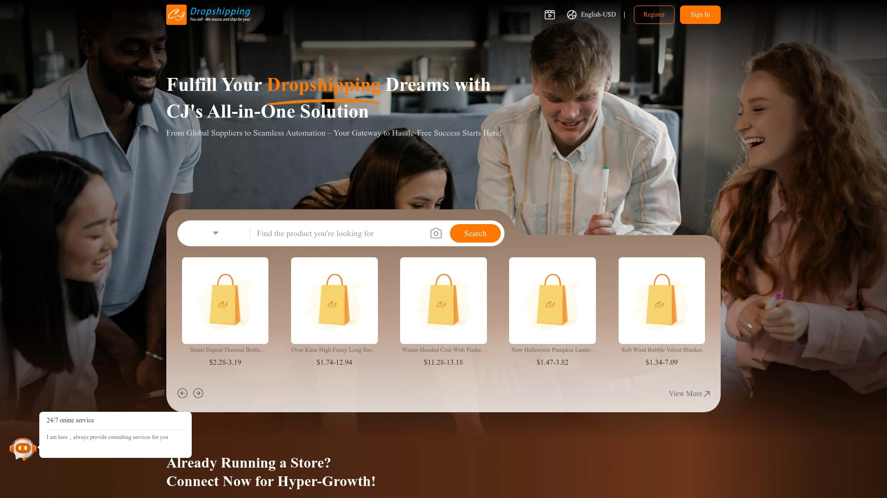

CJDropshipping是综合性代发平台,虽然涵盖多个品类,但在美妆和护肤品领域提供了强大的白标解决方案。平台特别适合想要快速测试和扩展定制美妆产品创意的卖家,且无需前期库存承诺。

**独特功能:** 提供定制采购请求服务,如果目录中没有你想要的美妆产品,可以提交定制采购需求。这种灵活性让卖家不受限于现有SKU,能实现更个性化的产品组合。

**学习曲线考量:** 由于产品覆盖广泛,新用户可能需要时间来导航全部美妆SKU并理解最佳定制选项。但一旦熟悉平台,其庞大的产品库和定制能力将成为重要竞争优势。

物流时效7-20天,服务全球市场。平台在2025年被列为美国顶级护肤代发供应商之一,证明其在美妆垂直领域的可靠性。

***

## **[Modalyst](https://modalyst.co)**

连接全球供应商的市场平台,品牌美妆与私标产品并存。

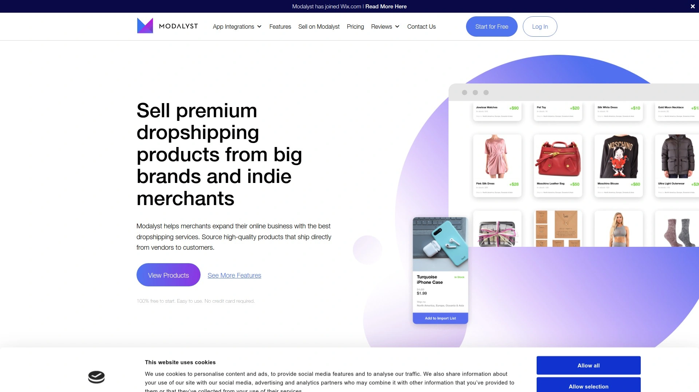

Modalyst是成熟的代发平台,提供来自美国和全球供应商的多品类产品,其中美妆和健康品是重要组成部分。平台混合了私标和品牌美妆产品,并提供生态友好、无残忍测试的选项,迎合可持续美妆的增长需求。

**技术集成优势:**
- 直接与Shopify和BigCommerce同步,简化店铺管理
- 内置品牌功能如定制包装和logo设计
- 被大量新电商店铺信赖,新手友好的上手流程

**订阅模式考量:** 最佳的白标功能需要付费高级订阅。但对于刚进入美妆领域、需要易用平台和可靠供应商网络的初学者,Modalyst的投资回报清晰可见。

如果你想要在一个平台上同时访问品牌产品和私标定制能力,Modalyst提供了这种双重优势。

---

## **[Pinnacle Cosmetics](https://www.pinnaclecosmetics.com)**

加拿大38年品牌,零MOQ彩妆和护肤品全球发货。

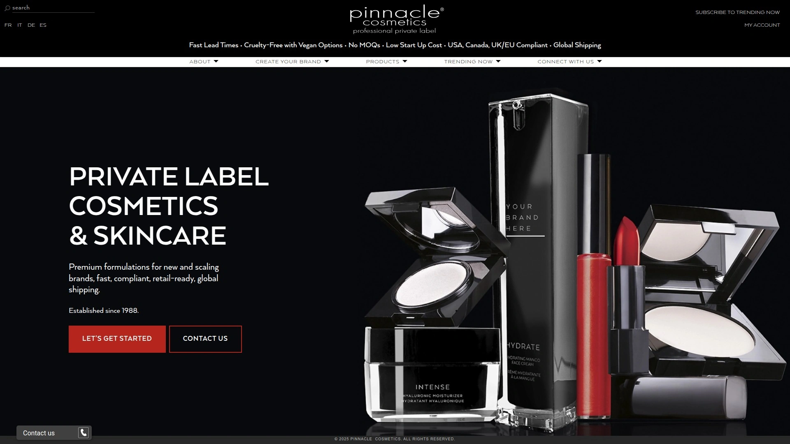

Pinnacle Cosmetics自1988年以来一直是私标化妆品制造商,专注于彩妆和护肤品。作为加拿大公司,他们为全球20,000多个品牌提供支持。

**制造与合规标准:**
产品在加拿大符合GMP标准的设施中生产(铅笔类产品除外),提供无残忍测试和多品类的纯素选项。配方符合美国、加拿大、英国/欧盟的合规要求,支持全球销售。

**灵活订购政策:**
- 无最低订购量(MOQ),可以精确订购所需数量
- 大多数首次品牌订单在批准设计稿和付款后2-3周内发货
- 提供策划的样品套装或单点样品,让你在首次采购前测试色调和质地

**专业支持:** 设有私人展厅,可预约品牌经理协助选择产品和展示单元;无法到场的客户可预约全球视频会议。

Pinnacle提供的是经过验证的内部配方,让品牌能快速推出符合零售标准的产品。对于需要高合规性、快速上市时间和零MOQ灵活性的品牌,这是可靠选择。

***

## **[GreenDropShip](https://greendropship.com)**

天然有机美妆专家,主打清洁美容和环保配方。

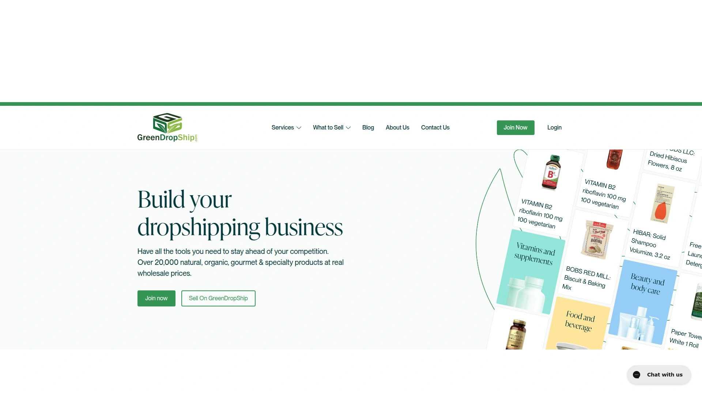

GreenDropShip聚焦天然、有机和环保品牌,包括个人护理和健康品类。平台特色是与拥有白标协议的天然美妆品牌合作,所有产品从美国仓库履约。

**清洁美容定位:** 重点关注无残忍测试和生态友好配方,非常适合构建强调可持续性的清洁美妆品牌。在消费者日益关注成分透明和环境影响的趋势下,这种定位具有明显市场优势。

**技术与物流:** 与Shopify和WooCommerce集成,美国境内订单5-14天送达,国际订单时效较长。

对于那些品牌价值观与环保、天然、伦理采购对齐的创业者,GreenDropShip提供了一致的供应链解决方案。其有机认证和清洁美容专业度帮助品牌在拥挤的美妆市场中建立差异化身份。

***

## **[FragranceNet](https://www.fragrancenet.com)**

香水美妆综合供应商,涵盖香氛、护肤和美发全线。

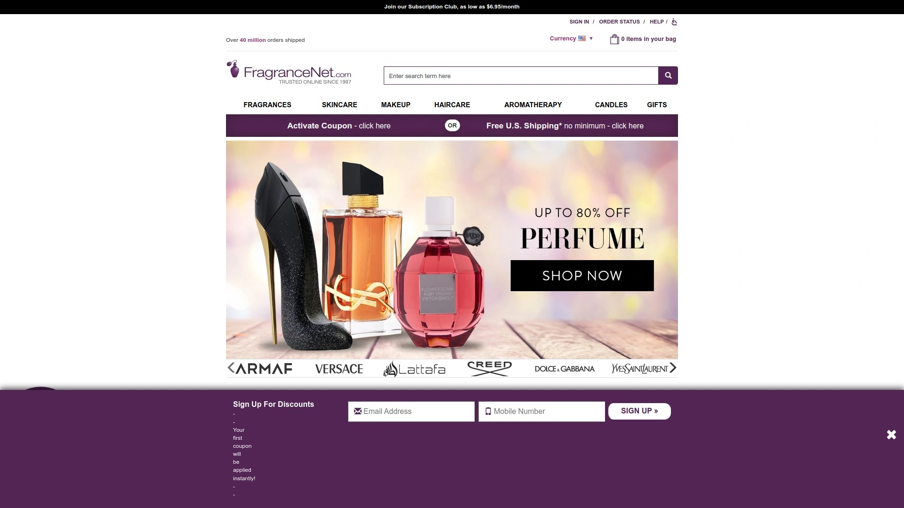

FragranceNet是专注于美妆产品的代发供应商,提供大量香水、护肤品和美发护理解决方案。平台特色是产品种类的广度,让卖家能够创建综合美妆店铺而非单一品类。

产品线横跨三大核心领域:香水(男香、女香、中性香)、护肤品(面部护理、抗衰老、保湿等)和美发产品(洗护、造型、护理)。这种多样性使其适合想要提供一站式美妆购物体验的电商。

美国订单通常5-14天送达。作为专业美妆供应商,FragranceNet在香水品类的深度和品牌产品的可得性方面具有优势。

如果你的业务模式是销售知名品牌产品而非私标创建,FragranceNet的品牌产品目录和可靠物流体系值得考虑。

---

## **[Printful](https://www.printful.com)**

按需定制专家,打造个性化美妆配套产品。

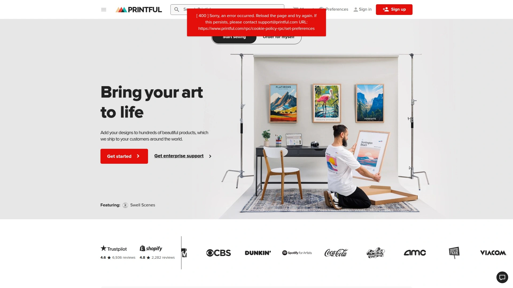

Printful是知名的按需打印平台,虽然以服装和配件闻名,但也提供定制美妆和身体护理产品服务。平台专注于私标服务,让创业者用自己的品牌设计肥皂、乳液和身体洗液。

**全托管模式:** Printful处理从制造到包装的一切环节,对于想要打造美妆品牌但不想介入生产细节的创业者来说是无忧方案。这种端到端服务特别适合已经在Printful上销售其他产品类别的卖家,可以轻松将美妆品加入现有产品线。

**创意自由度:** 平台的定制能力使得产品设计具有高度个性化空间,从标签到配方都可以体现你的品牌独特性。

对于追求全面品牌控制和一体化生产履约的创业者,Printful的美妆代发服务是可靠扩展。

---

## **[Syncee](https://syncee.com)**

全球供应商市场,自动库存更新保证数据准确。

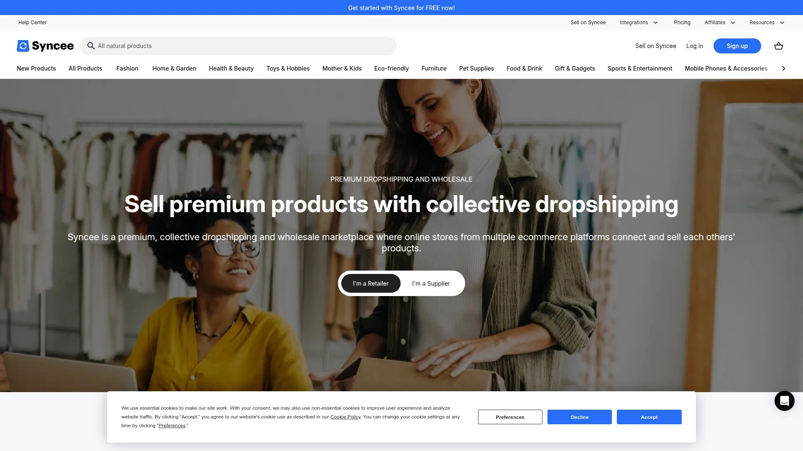

Syncee是连接全球可信供应商的强大代发平台,提供广泛的沐浴和身体护理产品,包括肥皂、乳液和身体洗液。平台用户界面友好,与Shopify和WooCommerce等主流电商平台无缝集成,让代发店铺管理变得轻松。

**自动化优势:** Syncee提供自动库存更新功能,确保产品列表始终准确,避免超卖和客户投诉。这种自动化对于管理大量SKU的卖家尤其重要,节省手动更新的时间成本。

**供应商网络:** 平台连接全球范围内的供应商,为卖家提供多样化的产品选择和价格比较机会。对于想要测试多个供应商或寻找特定美妆细分品类的创业者,Syncee的市场模式提供了灵活性。

整合便利性和自动化功能使Syncee成为注重运营效率的美妆代发卖家的理想工具。

***

## **[EPROLO](https://www.eprolo.com)**

中国全球双仓布局,化妆品工具和通用商品兼顾。

EPROLO是基于中国但服务全球的代发平台,提供化妆品、护肤品、美妆工具和通用商品。平台的优势在于产品成本竞争力和品类广度。

**物流网络:** 虽然总部在中国,但EPROLO建立了全球仓库网络以缩短配送时间,标准发货时效为7-20天。对于价格敏感型市场或追求高毛利空间的卖家,EPROLO的低成本优势明显。

**产品范围:** 除了化妆品和护肤品,平台还提供化妆工具(刷具、海绵等)和其他美妆周边,让卖家能够组建完整的美妆产品生态。

需要权衡的是,相比美国或欧洲本土供应商,物流时效略长。但对于不急于当日或次日达、更看重成本结构的业务模式,EPROLO是性价比优选。

---

## **[MySwissLab](https://myswisslab.com)**

瑞士制造品质,专注可持续和公平贸易配方。

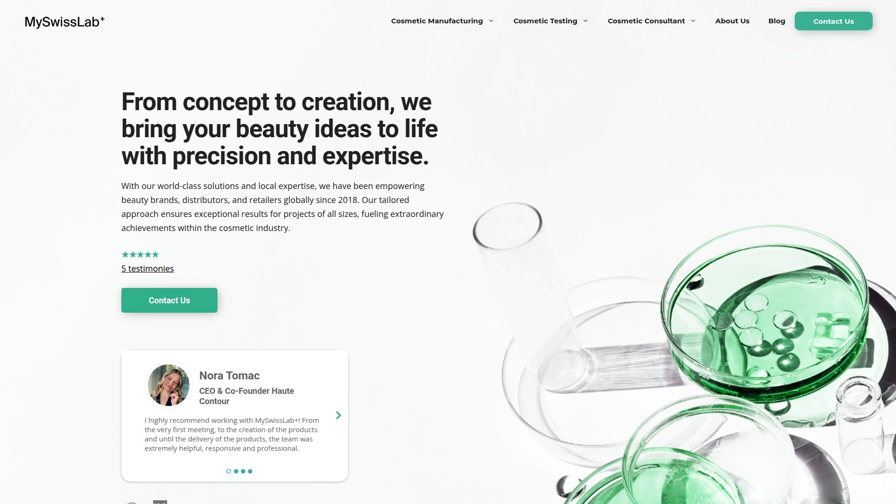

MySwissLab是瑞士领先的私标化妆品和护肤品制造商,对质量有着坚定承诺。作为瑞士制造商,平台专注于私标化妆和护肤,强调可持续性和符合公平贸易标准的配方。

**全方位服务体系:**
提供从产品开发、制造到包装和设计的全套服务,涵盖从粉底、口红到护肤品的所有品类,均遵循无残忍测试实践生产。

**瑞士品质标签:** "瑞士制造"在美妆行业代表高品质、精密和奢侈感,这个标签本身就是营销资产。对于瞄准高端市场、愿意为欧洲品质溢价的品牌,MySwissLab的瑞士血统提供了强大的品牌叙事基础。

平台提供定制配方服务,支持品牌推出独一无二的产品。无论是启动新美妆线还是扩展现有系列,MySwissLab的私标和白标服务都是实现增长和成功的关键。

***

## **[Mana Private Label](https://manaprivatelabel.com)**

45年高端护肤配方经验,稳定维C和多肽等创新成分。

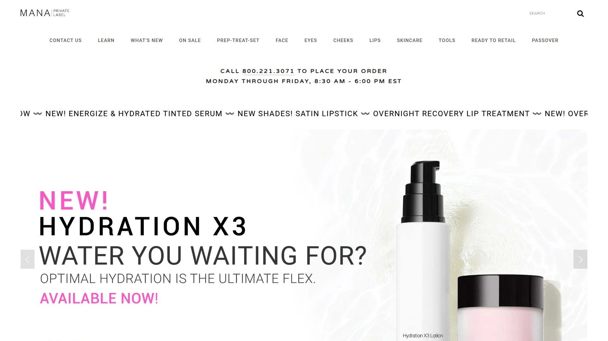

Mana Private Label是拥有超过45年经验的护肤和化妆品制造商,专注于服务追求高端护肤品的美妆品牌。平台特色是使用创新成分如稳定维生素C、多肽、novoretin等前沿配方技术。

**科学驱动方法:** Mana的配方开发采用科学支撑的方法,确保产品能提供可测量的效果,支持营销声明和客户满意度。这种专业度对于需要在竞争激烈的护肤市场中建立信誉的品牌至关重要。

**目标市场定位:** 丰富的行业经验和前沿成分使用使Mana特别吸引瞄准成熟护肤市场的品牌。如果你的客户群是对成分有认知、追求抗衰老或专业级护肤效果的消费者,Mana的高级配方能支撑你的品牌定位。

对于不满足于基础配方、需要真正差异化产品的护肤品牌,Mana的45年专业积累和创新成分库是重要竞争力来源。

***

## **[Made By Nature Labs](https://madebynaturelabs.com)**

保加利亚清洁美容专家,有机天然配方领导者。

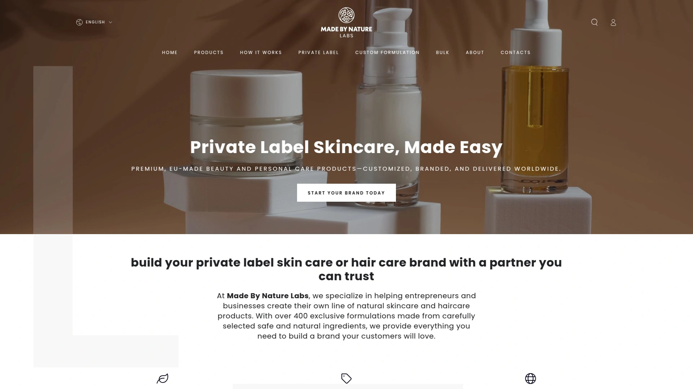

Made By Nature Labs总部位于保加利亚,专门设计高端天然和有机护肤品。平台对天然成分和可持续制造实践的专注,使其成为增长中的清洁美容市场领导者。

**清洁美容承诺:**
- 广泛的有机认证和天然成分配方组合
- 高端配方瞄准奢侈市场细分和成熟消费者
- 环保生产流程和包装选项
- 制造设施符合严格的欧洲化妆品法规和质量要求

**市场吸引力:** 配方不含争议成分,吸引注重健康的消费者。在消费者日益关注成分透明、环境影响和伦理采购的时代,Made By Nature Labs的有机天然定位与市场趋势完美契合。

在2025年顶级私标护肤制造商排行中位居前列。对于品牌价值观与清洁美容、可持续发展对齐的创业者,这个平台提供了产品和理念的一致性。

---

## **[Dropship Beauty](https://www.dropshipbeauty.com)**

美妆全品类批发,从假发到唇彩一应俱全。

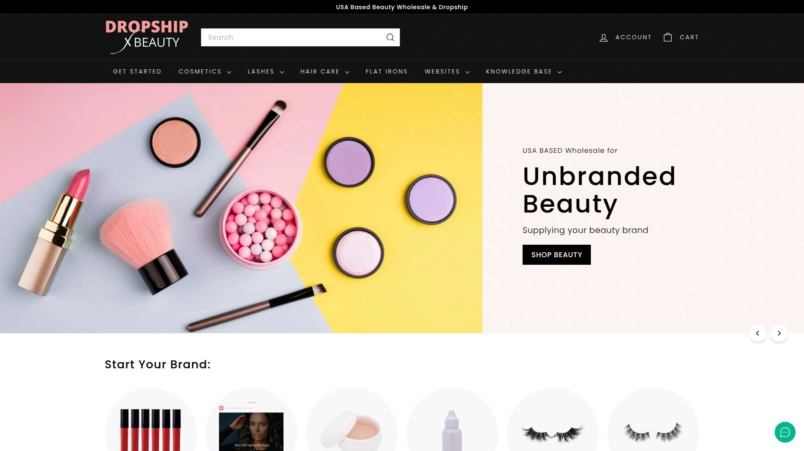

Dropship Beauty提供全面的工具和产品,帮助创业者启动自己的美妆业务,销售头发产品、假发、化妆品、睫毛、美发护理、唇彩等。平台的特色是品类的完整性——不仅仅是化妆品或护肤品,而是覆盖整个美妆生态。

**一站式美妆采购:** 对于想要建立综合美妆店铺的卖家,Dropship Beauty避免了在多个供应商之间周旋的麻烦,从一个平台就能采购多样化的美妆产品。

**新品更新:** 平台持续添加新产品,让卖家始终能够跟上美妆趋势和季节需求。

如果你的商业模式是提供广泛的美妆选择而非专注单一品类,Dropship Beauty的全品类覆盖和批量代发能力是理想匹配。

***

## **[Trilogy Laboratories](https://trilogylaboratories.com)**

药学科学家创立,抗衰老和水疗级护肤方案。

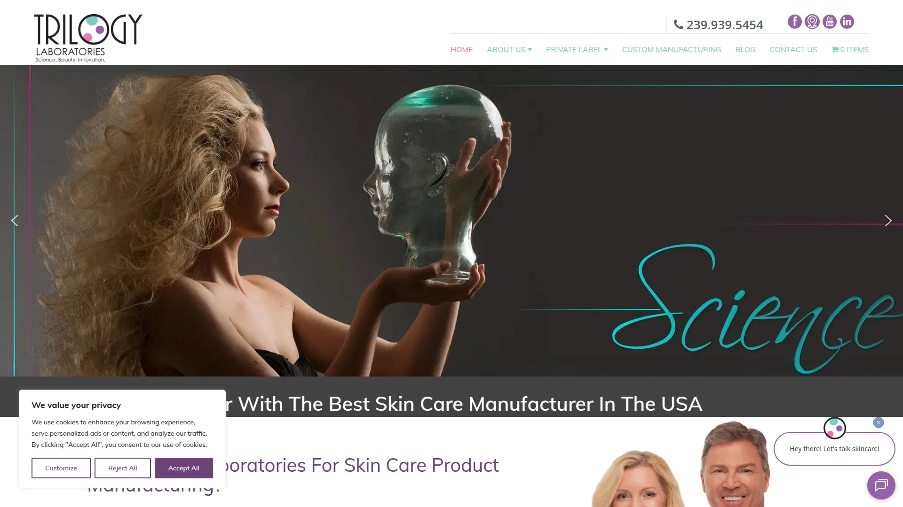

Trilogy Laboratories由药学科学家创立,专注于有科学支撑的高性能护肤配方。平台主要关注抗衰老产品、水疗级护理和皮肤科解决方案。

**双轨服务模式:**
1. 私标制造:提供使用肽、类视黄醇等流行护肤成分创建的白标产品系列,白标产品每产品需12件MOQ
2. 定制制造:允许品牌创建定制配方,定制订单每产品需100-500件MOQ

**科学背书:** 创始人的药学背景为配方提供了额外的信誉层,这在护肤市场中消费者越来越重视成分科学的背景下是重要资产。

位于佛罗里达州,不提供代发服务,更适合有一定规模、能够承担批量订购的品牌。对于追求专业级、皮肤科医生推荐质量的护肤品牌,Trilogy的科学方法和高性能配方是差异化优势。

***

## **[Spocket](https://www.spocket.co)**

欧美供应商网络,快速发货和品牌产品并重。

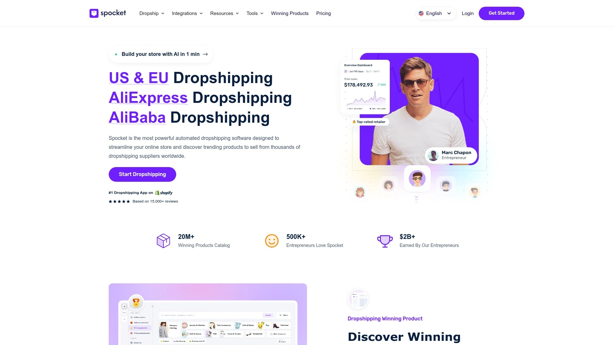

Spocket是广受推荐的代发平台,以连接欧美供应商闻名,确保比亚洲供应商更快的发货时效。虽然覆盖多品类,但美妆和健康品是其重要组成部分。

**供应商质量:** Spocket精选的供应商网络意味着产品质量通常高于通用市场平台,特别适合追求品牌产品和快速物流的卖家。

**市场定位:** 对于服务北美和欧洲市场、客户期待快速交付的美妆电商,Spocket的地理优势明显。平台在服装、美妆和电子产品等热门品类中提供了来自60多个代发供应商的产品选择。

与Shopify等主流平台的整合使得产品导入和订单管理流程简化。如果你的优先级是发货速度和供应商可靠性而非最低价格,Spocket是平衡质量与效率的选择。

***

## **[AOP+ (All Over Print)](https://aopplus.com)**

英国手工美容品,精油和天然皂品牌化。

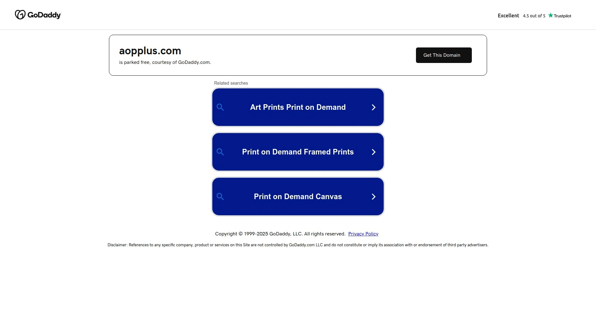

AOP+以按需打印产品闻名,但也提供白标美容线,包括精油、手工皂和护肤品。平台的独特之处在于将手工美容品与定制品牌相结合。

**特色服务:**
- 英国履约,全球发货
- 提供带定制品牌的手工美容产品
- 生态环保包装可选
- 与Shopify和Etsy集成

**市场适配性:** 更适合手工或天然产品美学品牌,产品目录规模小于传统美妆供应商。如果你的品牌故事围绕手工制作、天然成分、小批量生产展开,AOP+的产品特性与这种叙事完美契合。

对于追求健康或天然产品主题、想要建立强品牌身份的卖家,AOP+提供了产品和品牌价值观的一致性。

***

## **[Hertwill](https://www.hertwill.com)**

爱沙尼亚高端美妆,欧洲5-14天快速送达。

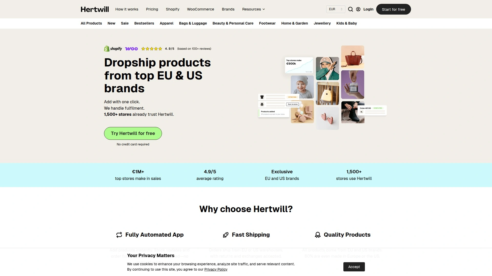

Hertwill是总部位于爱沙尼亚(欧洲)的代发供应商,专注于高端美妆、护肤和健康产品。平台的欧洲定位为服务欧洲市场的卖家提供了物流优势。

**物流时效:** 欧洲境内订单5-14天送达,全球发货时效根据目的地有所不同。对于主要服务欧盟客户的电商,Hertwill的本地履约避免了跨大洋运输的延迟和关税复杂性。

**产品定位:** 专注于高端美妆和健康产品意味着平台适合瞄准中高端市场的品牌。如果你的客户群愿意为品质和快速交付支付溢价,Hertwill的产品组合能支持这种定价策略。

对于欧洲本地电商或想要测试欧洲市场的国际卖家,Hertwill提供了地理和产品类型的双重优势。

***

## 常见问题

**美妆代发最低订购量是多少?**
大多数现代美妆代发平台已经取消了最低订购量要求,如Jubilee、Blanka和Selfnamed都支持零MOQ或极低MOQ(如10件起订)。这种趋势让新手创业者能够以最小风险测试产品和市场,无需大量前期资金投入。传统制造商可能仍有较高MOQ要求,但专注于代发的平台普遍采用灵活订购政策。

**私标美妆产品的利润率有多高?**
私标美妆的利润空间通常相当可观,以Selfnamed为例,采购价约£10的产品建议零售价£19.14,投资回报率可达131.58%。具体利润取决于你选择的供应商、产品类型和目标市场定位。护肤品因为高重购率(30-60天一次)特别适合建立长期盈利的订阅模式。成本控制关键在于平衡产品质量、物流速度和品牌溢价能力。

**美妆代发的发货时效如何?**
发货时效主要取决于供应商地理位置和你的目标市场。美国本土供应商如Jubilee、Blanka和Beauty Joint通常5-14天送达美国订单,欧洲供应商如Selfnamed和Hertwill在欧洲境内也能实现类似时效。中国或全球平台如EPROLO和CJDropshipping的标准时效为7-20天。快速发货已成为客户期待,选择地理位置接近目标市场的供应商能显著提升客户满意度。

---

## 开始你的美妆品牌之旅

从零库存风险到全球发货网络,2025年的美妆代发生态已经成熟到让任何人都能低门槛启动自己的美妆品牌。无论你是追求美国品质和快速测试的新手,还是需要欧洲有机认证的清洁美容倡导者,这份榜单都覆盖了不同定位和需求。记住,[Jubilee](https://www.jubilee.beauty)以其零MOQ、美国本土发货和全品类覆盖,特别适合想要快速启动并保持灵活性的创业者——免费计划让你可以先探索再承诺,降低决策风险。
